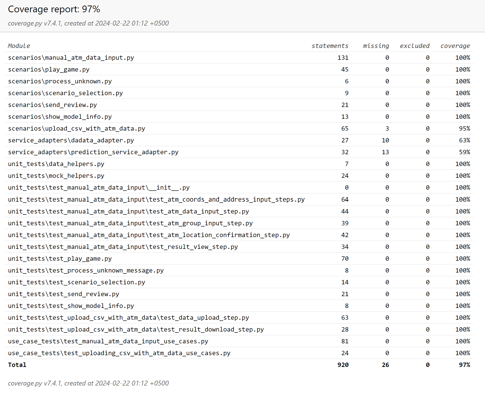

## Telegram-бот для прогнозирования популярности размещения банкомата
>_Репозиторий содержит зафиксированную для сдачи ДЗ версию кода бота для предсказания индекса популярности
банкомата, разрабатываемого в рамках годового проекта магистратуры МОВС-2023 (команда: Алина Лукманова, Антон Зайцев,
Сергей Вершинин). Основной репозиторий с кодом проекта доступен [здесь](https://github.com/SeVlVershinin/atm-project/) и 
содержит код данного бота в подкаталоге ```tg-bot```._ 

Бот позволяет получать предсказания индекса популярности банкомата на основе данных о его местоположении. С его помощью
вы сможете: 
 - выполнить интерактивный ввод координат или адреса расположения банкомата и получить предсказание 
индекса популярности (```/manual_input```);
 - отправить CSV-файл с данными о банкоматах и в ответ получить файл, дополненный предсказанными индексами
(```/upload_csv```);
 - просмотреть основную информацию об используемой модели предсказания (```/model_info```);
 - отправить нам отзыв о работе бота (```/send_review```);
 - сыграть с ботом в игру "угадай число" (```/play```).

Для взаимодействия с ботом перейдите по ссылке [@atm_project_bot](https://t.me/atm_project_bot). Чтобы упростить работу, 
вы можете использовать [следующий csv-файл](atm_data_sample.csv) как шаблон для передачи боту данных о банкоматах 
(или отправить его без изменений и просмотреть полученный ответ).

Для развертывания бота можно воспользоваться 
[размещенным на Docker Hub образом](https://hub.docker.com/repository/docker/sevlvershinin/atm-project-bot/general) 
или запустить бота непосредственно на своем компьютере. Более подробная информация о развертывании бота и 
соответствующего сервиса предсказаний размещается в общем [описании проекта](../README.md).

### Необходимые переменные среды
Для корректной работы бота необходимо, чтобы были заданы следующие переменные среды: 
- ```ATM_PROJECT_BOT_TOKEN``` - токен телеграм-бота
- ```ATM_PROJECT_PREDICTION_SERVICE_URL``` - URL сервиса предсказаний
- ```ATM_PROJECT_TEAM_CHAT_ID``` - ID телеграм-чата, в который бот отправляет полученные отзывы 
- ```DADATA_API_KEY``` - API-ключ для работы с сервисом dadata.ru

### Особенности реализации
Код, реализующий сценарии работы бота находится в каталоге ```scenarios```. Каждый файл содержит реализацию 
отдельного сценария: 
- [scenario_selection.py](scenarios/scenario_selection.py) - вывод стартового сообщения бота для выбора сценария; 
- [manual_atm_data_input.py](scenarios/manual_atm_data_input.py) - ручной ввод данных о банкомате и получение 
предсказания;
- [upload_csv_with_atm_data.py](scenarios/upload_csv_with_atm_data.py) - отправка csv-файла с данными и получение 
ответа с предсказаниями;
- [show_model_info.py](scenarios/show_model_info.py) - просмотр сообщения с информацией об используемой модели;
- [scenarios/send_review.py](scenarios/send_review.py) - отправка отзыва о работе бота;
- [play_game.py](scenarios/play_game.py) - игра с ботом в "угадай число".

Каждый из указанных файлов содержит свой ```router```, отвечающий за маршрутизацию сообщений в рамках соответствующего 
сценария. Сценарии, предполагающие взаимодействие с пользователем, также содержат коллекцию состояний (State) бота в 
рамках соответствующего сценария. Для сценариев, содержащих большое количество состояний (ручной ввод данных и загрузка 
csv-файла), все обработчики реализованы как статические методы классов с названиями, соответствующими состояниям. Это 
позволяет упорядочить большое число обработчиков в таких сценариях и облегчает дальнейшую модификацию кода.

Файл [main.py](main.py) отвечает за запуск бота и регистрацию всех роутеров в одном месте.

Каталог ```service_adapters``` содержит адаптеры к сервису предсказаний 
([prediction_service_adapter.py](service_adapters/prediction_service_adapter.py)) и стороннему сервису dadata.ru 
([dadata_adapter.py](service_adapters/dadata_adapter.py)), которые инкапсулируют в себе особенности отправки запросов
к этим сервисам.

### Контроль кода с помощью flake8
Для контроля качества кода использована библиотека flake8 со стандартными настройками (за исключением измененной на 119
длины строки - см.настройки в файле [.flake8](.flake8)) 

### Набор автоматических тестов
Для бота реализован набор автоматических тестов, состоящий из: 
- unit-тестов (каталог [unit_tests](unit_tests)), которые детально тестируют каждый handler бота, изолируя его от 
внешних зависимостей с помощью mock-объектов. Наиболее важными среди них являются тесты handler-ов, реализующих
сценарий ввода пользователем данных о местоположении банкомата (подкаталог [test_manual_atm_data_input](unit_tests/test_manual_atm_data_input)) 
и сценарий загрузки csv-файла с данными о различных местоположениях для банкоматов и скачивания csv-файла, 
дополненного результатами прогнозирования (подкаталог [test_upload_csv_with_atm_data](unit_tests/test_upload_csv_with_atm_data))
- use-case тестов (каталог [use_case_tests](use_case_tests)) для трех вышеупомянутых наиболее критичных сценариев, 
которые проверяют работу handler-ов, реализующих данные сценарии, как единого целого.

Тесты реализованы с использованием библиотек pytest и unittest.mock. Специализированные библиотеки для проверки
ботов на aiogram не использовались в силу наличия ошибок и скудной документации.

Результаты оценки тестового покрытия приведены на изображении ниже.

